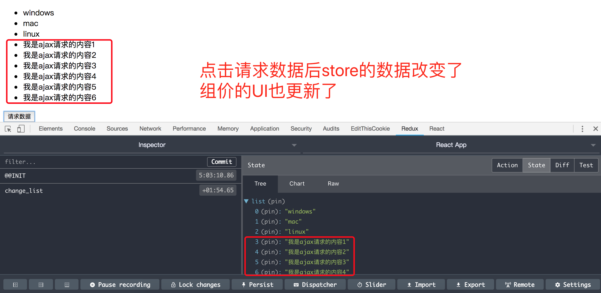

# 运行本项目
> npm install  
> npm start


# 手摸手带你撸redux：一阶
先说一下redux的工作流程。
- 第一步，创建一个store，相当于一个数据仓库；
- 第二步，React Component根据store里面的state显示UI；
- 第三步，React Component根据需求派发action给store。(dispatch(action))；
- 第四步，store根据React Component派发的action去reducer里面找对应的操作；
- 第五步，reducer告诉store怎么操作数据；
- 第六步，store更新state；
- 第七步，React Component根据store中的state更新UI；

## 1-安装redux
> npm install redux --save

## 2-创建store
--|src  
----|store  
------|index.js  
------|reucer.js

> index.js 是创建store  
> reducer.js 是告诉store怎么处理数据

### 2.1 - index.js
```js
import { createStore } from 'redux'; import reducer from './reducer';

// 使用redux的createStore方法创建store
const store = createStore(
  reducer,
  window.__REDUX_DEVTOOLS_EXTENSION__ && window.__REDUX_DEVTOOLS_EXTENSION__() // 这句话是让Chrome 的redux dev tools显示redux
);

export default store;

```

### 2.2 - redux.js
```js
// store中默认的state
const defaultState = {
  list: ['windows', 'mac', 'linux']
}


export default (state = defaultState, action) => {
  // 根据组件派发过来action的type做出不同的响应
  switch (action.type) {
    case 'change_list':
      // reducer 可以接收state，但是不能修改state,所以用一个深拷贝来复制state，
      // 然后返回一个newState，告诉store就这么修改state
      const newState = JSON.parse(JSON.stringify(state));
      newState.list = newState.list.concat(action.value);      
      return newState;
    default:
      return state;
  }
}
```

## 3 组件中派发action
```js
import React, { Component } from 'react';
import store from './store';
import axios from 'axios';

class App extends Component {

  constructor(props) {
    super(props);
    // 把store里面的state赋值给组件的state
    this.state = store.getState();

    this.getMore = this.getMore.bind(this);
    this.handelStoreChange = this.handelStoreChange.bind(this);

    // 组件订阅store， 当store改变时执行改方法
    store.subscribe(this.handelStoreChange);
  }

  // 当store改变时触发的方法
  handelStoreChange() {
    // store改变重置组件的state为store的state
    this.setState(store.getState());
  }

  getMore() {
    axios.get('/api/list.json').then((res) => {
      // 创建action，action是一个对象，有一个必须的type属性，
      const action = {
        type: 'change_list',
        value: res.data.data
      }
      // 把请求回来的数据放进action派发出去
      store.dispatch(action);
    }).catch((err) => {
      console.log(err);
    })
  }
  
  render() {
    return (
      <div className="App">
        <ul>
          {
            this.state.list.map((item,index) => {
              return (
                <li key={index}>{item}</li>
              )
            })
          }
        </ul>
        <button onClick={this.getMore}>请求数据</button>
      </div>
    );
  }
}

export default App;

```

## 总结
本项目是redux最简版，还有很多地方可以优化，action可以单独抽出来，actionType也可以单独抽出来

;

;
